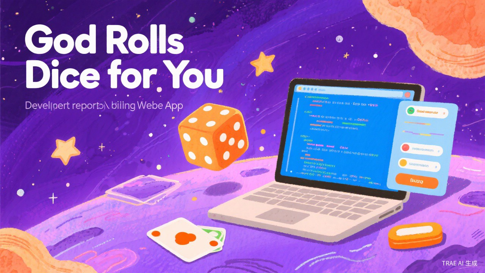

# 从0到1做「上帝帮你掷骰子」

> 一个人，AI辅助，两周上线。这不是技术教程，是一份完整的产品决策记录。每个判断下面都跟着"这个组件怎么做"——看完你能学会怎么跟AI配合，从零做出自己的产品。

---

## 封面



---

## 用户价值

纠结的时候，你需要不是一个答案，是一个能让自己心安理得停止想的理由。

这个产品的用户，不是"不知道选什么"的人，是"其实心里有答案，但不敢确认"的人。

中午吃什么——他其实想吃火锅，但觉得不健康。发不发消息——她其实想发，但怕打扰。出门不出门——他其实想出去，但懒得换衣服。

他们需要的不是"帮你做决定"，是一个"可以名正言顺停止纠结的许可"。

"宇宙说冲"——行，那就冲。
"宇宙说别等"——好，不等了。

这句话不是答案，是台阶。产品给的不是决策，是许可。

后面所有的判断，都是围绕这个核心价值做的。每个判断在讲"为什么这样做"之前，先说清楚"这服务于哪个用户价值"。

---

## 起因：为什么做这个产品

有天中午纠结吃什么，划了十分钟外卖APP什么都没点。

突然想到：能不能做一个东西，帮我做这种无聊的决定？

但我不想做一个"随机器"。市面上已经有很多了，摇一摇、转一转、抽个签——本质上都是随机，穿一层玄学外衣。

**如果我也做随机，我跟它们有什么区别？**

这个反问，成了整个产品的起点。

---

## 判断一：不做随机工具，做真正的推演引擎

> 服务于「许可感」——只有推演不是随机，用户才能心安理得地把结果当台阶

### 判断故事

市面上所有"帮我决定"的产品，核心逻辑都是 Math.random()。摇一摇、转一转、抽个签——换个皮肤而已。

我做了一个市场分析：打开应用商店搜"帮我决定"、"随机选择器"，前20个产品全是随机。没有一个在做真正的推演。

然后我想到大六壬。

大六壬是中国古代最高级的占卜术之一，它的排盘算法极其复杂——需要精确到分钟的时间、需要地理位置来推算节气、需要天干地支的完整运算体系。正因为它复杂，所以没有人用它来做消费级产品。

我的判断是：**后台是术，前台是势。**

后台用一套真正的推演算法（大六壬），让结果跟时间、空间挂钩——同一分钟在不同地点问同一个问题，答案可能不同。这让产品从"随机"变成了"推演"。

前台不讲术，讲势。用户不需要知道什么是四课三传、什么是天地盘。用户只需要看到：宇宙帮你想好了，答案在这里。

这个判断直接决定了产品的技术壁垒。

### 导致的组件：liuren-engine.js（大六壬排盘算法）

这是整个项目最核心的文件，1387行，实现了完整的大六壬排盘算法：

- 天干地支运算（十天干、十二地支、六十甲子）
- 节气推算（1901-2050年，每年12个节气的精确数据编码）
- 天地盘排布
- 四课推演（日干上神、日支上神）
- 三传起法（初传、中传、末传）
- 九宗门判定
- 神煞系统（天乙贵人、驿马、天将）
- 格局分析（前后引从、首尾相见、闭口等）
- 五行生克、六合六冲、三刑、空亡

### 这个组件怎么做

跟AI说：

```
帮我用JavaScript实现一个完整的大六壬排盘算法。

要求：
1. 输入：一个Date对象和一个城市名（可选）
2. 输出：完整的排盘结果，包括天地盘、四课、三传、神煞、格局

具体实现：
- 天干地支常量定义（十天干、十二地支、六十甲子）
- 节气数据：1901-2050年，每年12个节（小寒、立春、惊蛰...大雪），
  用十六进制编码，每个字节编码格式：
  byte1高5位=节气日(1-31)，低3位=月份高3位(0-7)
  byte2高1位=月份低1位，中5位=时(0-23)，低2位=分/15(0,15,30,45)
- 日柱计算：从已知基准日推算任意日期的干支
- 时柱计算：根据日干和时辰推算时柱
- 天地盘排布：月将加时，排天地盘
- 四课：日干上神、日干阳神、日支上神、日支阳神
- 三传：根据四课关系，按九宗门规则起三传（贼克、比用、涉害、遥克...）
- 神煞：天乙贵人、驿马、天将（白虎、青龙、朱雀、玄武）
- 格局：前后引从、首尾相见、闭口、三刑等
- 五行生克关系、六合六冲、空亡判定

用ES Module导出一个divine(date, city)主函数。
```

AI第一次输出的版本，排盘逻辑基本正确，但有几个问题：

1. 节气数据编码有误——解码出来的日期偏移了几天
2. 三传起法的九宗门优先级不对
3. 神煞查法有遗漏（比如天乙贵人的查法，甲戊庚牛羊，乙己鼠猴乡，有6组对应关系，AI漏了两组）

我让AI逐个修复，每个问题都是"看这段代码，输出不对，应该是xxx"——AI能理解并修正。

### 碰到的问题

大六壬需要精确时间和地点。精确时间好办，用 new Date() 就行。但地点意味着要请求定位权限。

这跟"轻量入口"矛盾。

用户打开产品，想的是"帮我选个外卖"，结果第一件事就是弹一个"是否允许获取你的位置信息"——体验直接崩了。

### 解决方案：只用当前时刻，权限后置

最终方案：

1. **时间**：直接用 new Date()，用户不需要输入任何时间
2. **地点**：不请求定位权限，默认使用一个中性值。大六壬的节气推算主要依赖日期，地点的影响是次要的
3. **权限页**：虽然HTML里保留了 page-permission，但实际流程中权限请求被后置了——用户点击卡片后直接进入计算，不再先弹权限

这个方案的好处是：用户从"点卡片"到"看到结果"，中间只有2秒加载动画，零摩擦。

### 重大转向：权限前置→权限后置

| 维度 | 之前 | 之后 |
|------|------|------|
| 用户路径 | 打开→权限弹窗→允许/拒绝→选卡片→结果 | 打开→选卡片→结果 |
| 摩擦点 | 权限弹窗挡在核心路径上 | 零摩擦 |
| 算法精度 | 有定位，精度更高 | 无定位，精度略低但不影响体验 |
| 代码改动 | classic-bridge.js 中 startFromUniverse() 直接调用 startCalculation()，跳过 requestGeoPermission() |

---

## 判断二：不追求"准"，追求"被理解"

> 服务于「被理解」——用户不是要一个冷冰冰的YES/NO，是要一个懂他处境的回答

### 判断故事

做大六壬排盘的时候，我一直在想一个问题：用户真的在乎排盘准不准吗？

答案是：**不在乎。**

用户在乎的是：这个结果有没有说到我心坎上。

"今天吃什么"这个问题，用户要的不是"宇宙说吃火锅"，用户要的是"宇宙说吃火锅，因为你最近太累了，需要一顿热乎的"。前者是答案，后者是被理解。

这个判断直接导致了两个设计决策：

1. **问题分层**：不同严重程度的问题，用不同的语气和UI来呈现
2. **两套结果页**：轻题用挂签卡，重题用海报风格

### 导致的组件：问题分层（L1/L2/L3）+ 两套结果页

decision-engine.js 里的 classifyQuestion() 函数实现了三级分层：

| 等级 | 定义 | 示例 | 语气 | 结果页 |
|------|------|------|------|--------|
| L1 | 轻拍板，不影响生活 | 今天吃什么、穿什么、洗不洗头 | 闺蜜语气（bestie） | 挂签卡（tagcard） |
| L2 | 社交站队，有轻微社交影响 | 发不发消息、要不要出门 | 闺蜜语气 | 挂签卡 |
| L3 | 有后续影响，需要认真对待 | 要不要表白、要不要辞职 | 神谕语气（oracle） | 海报风格 |

### 这个组件怎么做

跟AI说：

```
帮我实现一个问题严重程度分层系统。

输入：一个问题文本（比如"今天吃什么"）和一个模板ID（比如"eat_today"）
输出：问题等级（L1/L2/L3）、分类（daily/social/relationship/work）、语气模式、分享卡类型

规则：
1. L1（轻拍板）：日常小事，不影响生活。比如吃什么、穿什么、喝什么、洗不洗头、早不早睡、买不买
2. L2（社交站队）：有轻微社交影响。比如发不发消息、要不要出门
3. L3（有后续影响）：需要认真对待。包含关键词：联系、表白、分手、复合、辞职、换工作、跳槽、买房、投资、借钱、签约、结婚

模板ID到等级的映射表：
- eat_today → L1, daily
- wear_today → L1, daily
- drink_today → L1, daily
- go_out → L1, daily
- wash_hair → L1, daily
- sleep_early → L1, daily
- send_msg → L2, social
- buy_it → L1, daily
- custom → 根据问题文本关键词动态判定

自由输入的判定逻辑：
1. 先检查L3关键词库（relationship/work/major）
2. 再检查L2模式（朋友、同事、社交、约、见面、聚会）
3. 再检查细分分类（健身→fitness，学习→study，减肥→diet）
4. 都不匹配则默认L1/daily

语气模式：L3用oracle，其余用bestie
分享卡类型：L1用conclusion，L2用versus，L3用ask_help
```

### 碰到的问题：文案逻辑翻车

产品上线前做最后检查的时候，我发现了5处文案逻辑错误：

1. **"发给对方"按钮出现在不该出现的地方**：L1问题（比如"今天吃什么"）的分享按钮文案是"发给朋友吐槽"，但L2问题（比如"发不发消息"）的分享按钮文案是"发给那个让你纠结的人"——这个"对方"可能就是消息要发给的那个人，如果用户真的点了分享，等于把结果发给了当事人，非常尴尬

2. **毒舌模式下的"发给对方"更危险**：毒舌文案可能直接冒犯到当事人

3. **L3问题的CTA文案不当**：重题（比如"要不要表白"）的CTA是"先发给你信任的人看看"——但如果用户问的是"要不要跟老板提加薪"，这个CTA就不合适

4. **通用模板的文案太泛**：custom模板（我有一个问题）无论用户问什么都走同一套文案，缺乏针对性

5. **风险提示缺失**：8个轻题模板都没有风险提示，但有些场景（比如"买不买"）其实需要提醒

### 解决方案：5处文案修改

1. 删除了"发给朋友吐槽"按钮（与卡片内分享提示重复）
2. 为每个场景定制了不同的分享按钮文案（13个场景13种文案）
3. L3问题的CTA根据风险等级动态调整
4. 为custom模板增加了4个分类细分模板（约会/健身/学习/减肥）
5. 增加了通用风险提示（30%概率出现，4条轮换）

---

## 判断三：用户是谁？

> 服务于「低门槛」——用户纠结的时候不想打字，点一下就得到许可

### 判断故事

一开始我想做"所有人的所有问题"——一个万能决策助手。

但很快发现这行不通。如果用户可以输入任何问题，文案就没法做精准。你不可能为"今天吃什么"和"要不要跟男朋友分手"准备同一套文案。

所以我做了一个关键判断：**不做所有问题，只做13个具体场景。**

这13个场景覆盖了年轻人日常生活中最高频的纠结：

1. 今天吃什么
2. 今天喝什么
3. 今天穿什么
4. 要不要出门
5. 发不发消息
6. 买不买这个
7. 今天要洗头吗
8. 今天要早睡吗
9. 去不去约会
10. 今天要健身吗
11. 今天要学习吗
12. 今天要减肥吗
13. 我有一个问题（自定义入口）

### 导致的组件：13个场景选择卡片

首页的13张轨道卡片，每张对应一个场景。前8个是直连模板（data-tpl直接对应模板ID），后4个是映射模板（data-tpl="custom"，但data-q携带具体问题文本），最后1个是纯自定义。

这个设计的好处是：

- 每个场景都有专属文案库（title 3-10条、reason 3条、action 3条、trend 1条）
- 每个场景都有专属海报图（YES版+NO版，共26张）
- 每个场景都有专属分享按钮文案
- 每个场景都有专属金句库（oneLineQuote 5-10条）
- 每个场景都有专属分享梗（shareMeme 3条）

限制场景数量，是让每个场景的体验做到极致的前提。

---

## 判断四：怎么传播？

> 服务于「社交货币」——分享卡不是传播工具，是用户的情绪出口

### 判断故事

一个H5产品，没有APP安装量，没有推送通知，怎么让用户知道它？

答案只有一个：**分享**。

但"分享"这个动作，用户为什么要做？

用户不会因为"这个产品很好"而分享。用户会因为"这个结果太准了/太搞笑了/太说到我心坎上了"而分享。

所以分享不是产品的附加功能，分享是产品的核心传播机制。

### 导致的组件：个性化分享文案 + 分享卡Canvas绘制

两个层面：

**层面一：分享按钮文案个性化**

每个场景的分享按钮文案都不一样：

| 场景 | 分享按钮文案 |
|------|------------|
| 今天吃什么 | 发给那个最该请客的人 |
| 今天喝什么 | 发给今天要续命的人 |
| 今天穿什么 | 发给那个总问你穿什么的人 |
| 要不要出门 | 发给那个天天鸽你的人 |
| 发不发消息 | 发给那个让你纠结的人 |
| 买不买这个 | 发给那个剁手党 |
| 今天要洗头吗 | 发给那个最该洗头的人 |
| 今天要早睡吗 | 发给那个熬夜冠军 |
| 去不去约会 | 发给那个单身狗 |
| 今天要健身吗 | 发给那个健身狂魔 |
| 今天要学习吗 | 发给那个学渣 |
| 今天要减肥吗 | 发给那个吃货 |
| 我有一个问题 | 发给朋友吐槽 |

这些文案本身就是传播点——用户看到"发给那个最该请客的人"，会想到某个朋友，然后点分享。

**层面二：分享卡Canvas绘制**

share.js 用 Canvas 绘制了一张 750x1334 的分享卡，包含：品牌名、问题、海报插画、结论、金句、理由、建议、趋势、置信度、日期、编号。

### 这个组件怎么做

跟AI说：

```
帮我用Canvas绘制一张分享卡，尺寸750x1334（9:16比例），用于社交分享。

要求：
1. 背景：深色宇宙风（#1A1A2E），带星空点缀（60个随机小圆点）
2. 顶部：品牌名"上帝帮你掷骰子"，金色渐变文字
3. 问题区：用户的问题文本，小字灰色
4. 插画区：居中，圆角裁剪，cover模式适配，带主题色渐变装饰条
5. 内容区：
   - 结论标题：最大字号（42px），金色渐变
   - 金句：带「」包裹，紫色
   - 分隔线：短金线
   - 理由：带"宇宙的理由"标签
   - 建议：带"建议"标签，金色文字
   - 趋势：带"趋势"标签，灰色斜体
   - 置信度：小字，低调
6. 底部：日期 + 随机编号 + CTA"扫码让宇宙帮你选"
7. 每个场景有不同的主题色（accentColor）和顶部/底部渐变色

文字自动换行，支持中文。
字体：PingFang SC, Hiragino Sans GB, Microsoft YaHei, sans-serif。

提供3种模板：
- conclusion：L1轻题用，信息层级 结论>金句>理由>建议>趋势
- versus：L2社交题用，增加YES/NO对比
- ask_help：L3重题用，增加风险提示和CTA

导出为PNG图片，支持Web Share API分享，降级为下载。
```

### 重大转向：统一分享→个性化分享

最初所有场景用同一套分享文案"发给朋友吐槽"。后来发现这太浪费了——每个场景都有天然的社交关系，分享文案应该帮用户想到那个"该看到这个结果的人"。

改完之后，分享按钮本身就成了产品的一部分，而不只是一个功能按钮。

---

## 判断五：问题有轻重，产品要有分寸

> 服务于「分寸感」——轻问题给轻回答，重问题给重回答，许可才有说服力

### 判断故事

"今天吃什么"和"要不要跟男朋友分手"，这两个问题能放在同一个结果页里吗？

不能。

"今天吃什么"的结果页应该轻松、有趣、可截图发朋友圈。
"要不要分手"的结果页应该认真、有分量、让人愿意仔细看。

如果用同一个UI呈现这两种问题，要么轻题显得太沉重，要么重题显得太轻浮。

### 导致的组件：L1/L2/L3分流逻辑 + 两套结果页UI

分流逻辑在 classic-bridge.js 的 showResult() 函数里：

```javascript
if (result.seriousnessLevel === 'L3') {
    renderOracleResult(result);      // 海报风格结果页
    navigateTo('result-oracle');
} else {
    renderLightResult(result);       // 挂签卡风格结果页
    navigateTo('result-light');
}
```

两套结果页的设计差异：

| 维度 | 挂签卡（L1/L2） | 海报风格（L3） |
|------|-----------------|----------------|
| 视觉风格 | 轻松、色彩丰富、挂签卡造型 | 深沉、金色文字、海报感 |
| 语气 | 闺蜜/毒舌/摆烂三档切换 | 神谕语气，不可切换 |
| 风险提示 | 30%概率出现通用风险 | 必须出现，与问题相关 |
| CTA | "不信邪，再测一次" | "先发给你信任的人看看" |
| 分享卡 | conclusion/versus模板 | ask_help模板 |
| 海报图 | YES/NO双版本 | YES/NO双版本 |

### 这个组件怎么做

**挂签卡（L1/L2）的prompt：**

```
帮我做一个挂签卡风格的结果页，用于展示轻量级决策结果。

设计要求：
1. 整体比例9:16，模拟一张挂在绳子上的卡片
2. 顶部有一个圆孔和一根线（模拟挂绳）
3. 卡片背景：使用场景海报图作为背景（background-size:cover），上面叠加半透明深色渐变遮罩确保文字可读
4. 底部35%区域有更深的渐变遮罩（从透明到深色），确保底部文字始终可读
5. 内容从上到下：
   - 左上角：场景标签（如"EAT TODAY"），毛玻璃效果
   - 右上角：结果标签（"宇宙说 冲"/"先缓缓"/"宇宙说 别"）
   - 中间：标题（大字，白色，文字阴影）
   - 趋势一行（小字）
   - 金句区（带「」包裹，按逗号分段换行）
   - 理由区（带标签）
   - 建议区（按句号分段换行）
   - 统计区（置信度等）
   - 底部：分享提示（带脉冲动画）+ 时间戳
6. 卡片圆角28px，最大宽度360px
7. 所有文字有text-shadow确保在任何背景图上都可读
```

**海报风格（L3）的prompt：**

```
帮我做一个神谕海报风格的结果页，用于展示重大决策结果。

设计要求：
1. 深色宇宙风背景（#050510）
2. 卡片最大宽度400px，圆角16px
3. 顶部装饰条：紫色到绿色渐变
4. 品牌名：金色渐变文字（"上帝帮你掷骰子"）
5. 问题文本：小字，灰色
6. 海报插画区：圆角12px，高度180-200px
7. 分隔线：渐变细线
8. 金句区：紫色背景条，左边框，居中显示
9. 内容区：
   - 标签+标题（大字，白色）
   - 理由（灰色正文）
   - 风险提示（红色背景框，仅L3显示）
   - 建议（金色文字）
   - 趋势（灰色斜体）
10. 底部：分享梗（虚线分隔）+ 时间戳
11. 按钮区：两列并列（"再给上帝一次机会" | "让毒舌宇宙骂醒你"）
```

---

## 判断六：品牌概念——为什么叫"上帝帮你掷骰子"？为什么是地球？

### 判断故事

产品需要一个名字。

一开始我想叫"帮我决定"、"宇宙选择器"之类的。但都觉得太普通，没有记忆点。

有一天想到爱因斯坦那句话："上帝不掷骰子。"这是他反对量子力学的不确定性时说的。但量子力学证明了他错了——微观世界确实是不确定的。

所以"上帝帮你掷骰子"这个名字有两层意思：

1. 字面意思：让宇宙（上帝）帮你做决定
2. 隐含意思：不确定性才是世界的本质，纠结没有意义，掷个骰子就行了

这个名字有文化梗，有态度，而且一听就记住。

为什么是地球？

因为"宇宙帮你选"这个概念需要一个视觉锚点。如果只是一个抽象的旋转轨道，用户会觉得这是一个"工具"。但如果中心有一颗地球，用户会觉得这是"宇宙在看着你"。

地球代表的是：你在这里，宇宙在这里，宇宙正在帮你做决定。

### 导致的组件：3D旋转轨道首页 + 地球中心

首页的核心视觉：中心一颗3D地球，13张卡片围绕地球在3D轨道上旋转。

### 这个组件怎么做（详细）

**第一步：跟AI说"做一个宇宙风格首页"**

```
帮我做一个宇宙风格的首页，要求：

1. 页面中心有一颗3D地球（用CSS实现，不需要Three.js）
   - 地球直径280px，圆形
   - 用radial-gradient模拟球体光影效果
   - 有微妙的脉冲动画（8秒周期，scale 1→1.02）
   - 用纹理图片增加真实感

2. 13张卡片围绕地球在3D轨道上旋转
   - 轨道是椭圆形（水平半径320px，垂直半径120px）
   - 卡片均匀分布在轨道上（每张间隔360/13度）
   - 每张卡片110x130px，圆角16px
   - 卡片有背景图（13张不同的场景插画）
   - 卡片底部有标签文字（如"今天吃什么"）
   - 整体轨道30秒旋转一周

3. 交互：
   - hover时卡片边框变绿，有发光效果
   - 点击卡片进入对应场景
   - 中心地球下方有一个大按钮"让宇宙帮我选"（随机选一个场景）

4. 背景：深色宇宙风（#050510），带星空效果
5. 标题："上帝帮你掷骰子"，大字，发光效果
6. 副标题："把纠结交给宇宙，你只负责开心"

技术要求：
- 用CSS的perspective和transform-style: preserve-3d实现3D效果
- 用CSS animation实现旋转
- 不使用Three.js或其他3D库
```

**第二步：AI第一版的问题**

AI给出的第一版有5个严重问题：

1. **平面布局，不是3D**：卡片只是在一个平面上排列，没有3D旋转效果。原因是AI用了 CSS animation: rotateY，但没有给父容器设置 perspective
2. **卡片不转**：animation 写了但没生效，因为 transform-style: preserve-3d 没有设在正确的层级
3. **文字倒过来了**：卡片转到背面时，文字是镜像翻转的。虽然设了 backface-visibility: hidden，但卡片的子元素（标签文字）没有做反向旋转
4. **手机上点不中卡片**：卡片在旋转，手指碰到的时候卡片已经转走了
5. **背面卡片还可见**：转到背面的卡片虽然设了 backface-visibility: hidden，但因为3D变换的层级问题，某些角度还是能看到

**第三步：逐个解决**

**问题1：3D效果**

在轨道容器上加 perspective: 2000px，在轨道环上加 transform-style: preserve-3d。每个卡片用 rotateY(calc(var(--index) * (360deg / 13))) 设定初始角度，再用 translateZ(320px) 推到轨道上。

**问题2：旋转动画**

CSS animation 的 rotateY 动画直接设在 .orbital-ring 上。但后来发现 CSS animation 控制不了暂停/恢复，所以改成了 JS 的 requestAnimationFrame：

```javascript
// 用JS接管旋转，方便控制暂停/恢复
let orbitAngle = 0;
function animateOrbit() {
    orbitAngle += 360 / (30 * 60); // 30秒一圈，60fps
    orbitalRing.style.transform = `rotateY(${orbitAngle}deg)`;
    requestAnimationFrame(animateOrbit);
}
```

**问题3：文字反向旋转**

每个卡片的文字需要做反向旋转，抵消轨道旋转的影响：

```javascript
// 在每帧更新时，给每个卡片的文字做反向旋转
cards.forEach(card => {
    const cardAngle = orbitAngle + card.baseAngle;
    const normalizedAngle = ((cardAngle % 360) + 360) % 360;
    // 只在正面可见范围内显示文字
    if (normalizedAngle > 100 && normalizedAngle < 260) {
        card.style.opacity = '0';
    } else {
        card.style.opacity = '1';
    }
});
```

**问题4：手机触摸暂停**

```javascript
// 触摸时暂停旋转
orbitalStage.addEventListener('touchstart', () => {
    window._orbitPaused = true;
});
// 松手后800ms恢复（给用户足够时间点击）
orbitalStage.addEventListener('touchend', () => {
    setTimeout(() => {
        window._orbitPaused = false;
    }, 800);
});
// hover暂停
orbitalStage.addEventListener('mouseenter', () => {
    window._orbitPaused = true;
});
orbitalStage.addEventListener('mouseleave', () => {
    window._orbitPaused = false;
});
```

**第五步：背面卡片隐藏**

当卡片旋转到背面（角度>100度且<260度）时，设置 opacity=0，这样用户只能看到正面的卡片，视觉更干净。

**"让宇宙帮我选"随机按钮**

点击这个按钮，随机选一个模板ID，然后调用 startFromUniverse()：

```javascript
document.getElementById('btn-random-pick').addEventListener('click', () => {
    const templates = ['eat_today', 'drink_today', 'wear_today', 'go_out',
                       'send_msg', 'buy_it', 'wash_hair', 'sleep_early',
                       'custom'];
    const randomTpl = templates[Math.floor(Math.random() * templates.length)];
    startFromUniverse(randomTpl);
});
```

### 碰到的问题：开发时间翻倍

3D旋转轨道是整个项目中耗时最多的组件。最初预估1天，实际花了2天多。

主要时间花在：
- 3D变换的层级调试（perspective、transform-style、translateZ的配合）
- 移动端触摸交互（触摸暂停、点击区域扩大）
- 背面卡片隐藏的角度计算
- 响应式适配（移动端轨道半径从320px缩小到170px）

### 复盘：值，但如果时间紧选列表

如果时间紧张，首页完全可以做成一个简单的卡片列表——13个场景排成两列，点击进入。

3D轨道带来的价值是"品牌感"和"记忆点"，但不影响核心功能。如果两周内要上线，列表是更安全的选择。

但我不后悔做3D轨道。因为这个产品的核心竞争力不是算法，是体验。3D地球+旋转卡片，让用户在还没看到结果之前，就已经觉得"这个东西不一样"。

---

## 判断七：结果页该长什么样？

### 判断故事

结果页是用户停留时间最长的页面。用户会截图、会反复看、会分享给朋友。

所以结果页必须好看。不是"功能性地展示信息"，而是"好看到一个截图就能当壁纸"。

一开始我做了一个"海报风格"的结果页——深色背景、金色文字、信息密集。但很快发现两个问题：

1. **太重了**：L1问题（比如"今天吃什么"）用海报风格，显得太正式
2. **不好截图**：信息太多，截图发朋友圈显得太长

所以我做了第二次设计：**挂签卡**。

挂签卡的灵感来自日本的绘马——那种挂在神社里的小木牌。它的特点是：
- 小巧（9:16比例，像一张手机截图）
- 有挂绳和圆孔（增加仪式感）
- 背景是场景海报图（视觉丰富）
- 文字精简（只保留最核心的信息）

### 导致的组件：挂签卡（tagcard）设计

page-result-light 里的挂签卡组件，核心CSS：

- 卡片比例 9:16（max-width: 360px, aspect-ratio: 9/16）
- 背景用场景海报图（background-size: cover）
- 顶部35%叠加半透明深色遮罩（::before伪元素）
- 底部35%叠加更深的渐变遮罩（::after伪元素，从透明到深色）
- 顶部有圆孔和挂绳（纯CSS实现）
- 所有文字带 text-shadow 确保可读性

### 这个组件怎么做

跟AI说：

```
帮我做一个挂签卡（tagcard）风格的结果页。

核心设计：
1. 卡片比例9:16，模拟手机截图尺寸
2. 背景：用场景海报图（如 eat_today.jpg），background-size:cover
3. 双层遮罩确保文字可读：
   - ::before 全局遮罩：从上到下，rgba(0,0,0,0.3) → rgba(0,0,0,0.15) → rgba(0,0,0,0.4)
   - ::after 底部遮罩：底部35%区域，从透明到 rgba(15,10,30,0.85)
4. 顶部装饰：
   - 圆孔（18px圆形，白色半透明）
   - 挂绳（2px宽，76px高，白色半透明，微倾斜4度）
5. YES/NO双海报切换：
   - decisionBias为B或lean_B时，海报图路径加"_no"后缀
   - 比如 eat_today.jpg → eat_today_no.jpg
6. 内容层级（从上到下）：
   - 场景标签（毛玻璃胶囊）
   - 结果标签（"宇宙说 冲"/"先缓缓"/"宇宙说 别"）
   - 标题（26px，白色，粗体）
   - 趋势（10px，灰色）
   - 金句（16px，按逗号分段，每段加「」）
   - 理由区（带标签）
   - 建议区（按句号分段）
   - 统计区（置信度等）
   - 分享提示（带脉冲动画，可点击触发保存）
   - 时间戳
7. 移动端适配：max-height: calc(100vh - 100px)，内容溢出可滚动
```

**海报背景适配的关键：**

```
帮我处理一个CSS问题：

挂签卡的背景是海报图（background-size:cover），但海报图的颜色不可控——
有的偏亮、有的偏暗，可能导致上面的白色文字看不清。

解决方案：
1. 卡片本身设一个深色底色（#1a1030），这样即使海报图加载失败也不会白屏
2. ::before伪元素叠加一个从上到下的渐变遮罩（黑色半透明）
3. ::after伪元素在底部35%区域叠加更深的渐变（确保底部文字始终可读）
4. 所有文字都加text-shadow（0 2px 8px rgba(0,0,0,0.3)）
5. 海报图用background-origin:border-box + background-clip:border-box，
   确保图片覆盖整个卡片包括圆角区域
```

**YES/NO双海报切换逻辑：**

```javascript
// classic-bridge.js 中的海报选择逻辑
const isNo = result.decisionBias === 'B' || result.decisionBias === 'lean_B';
let posterSrc = POSTER_BASE_MAP[tid] ? posterPath(POSTER_BASE_MAP[tid]) : null;
if (isNo && posterSrc) {
    posterSrc = posterSrc.replace('.jpg', '_no.jpg');
}
```

每个场景有两张海报：xxx.jpg（YES版）和 xxx_no.jpg（NO版）。当结果是"别做"的时候，自动切换到NO版海报，视觉上就能感受到"宇宙说别"。

### 重大转向：海报卡片→挂签卡

| 维度 | 海报风格（第一版） | 挂签卡（最终版） |
|------|-------------------|-----------------|
| 信息密度 | 高（标题+金句+理由+风险+建议+趋势+CTA） | 低（标题+金句+理由+建议+趋势） |
| 视觉重量 | 重（深色+金色+信息密集） | 轻（海报图+简洁文字） |
| 截图友好度 | 低（太长） | 高（9:16比例，像一张卡片） |
| 适用场景 | L3重题 | L1/L2轻题 |
| 仪式感 | 中（像一张证书） | 高（像神社的绘马） |

---

## 判断八：文案是灵魂

### 判断故事

这个产品，算法是骨架，UI是皮肤，文案是灵魂。

用户不会因为"大六壬排盘很准"而记住这个产品。用户会因为"宇宙说：你不是不知道吃什么，你是什么都想吃"而记住这个产品。

文案决定了用户会不会截图、会不会分享、会不会再来。

### 导致的组件：decision-engine.js 里的文案库

decision-engine.js 是整个项目最大的文件（87KB），其中70%以上是文案。文案库的结构：

**每个场景模板包含：**
- title：3-10条结论标题
- reason：3条理由
- action：3条建议
- trend：1条趋势
- risk：0-3条风险提示（仅L3和部分场景）
- cta：0-2条CTA

**毒舌版模板（部分场景）：**
- 与温柔版相同的结构，但语气完全不同
- 比如：温柔版"今天喝珍珠奶茶"→ 毒舌版"喝吧，反正你也瘦不下来"

**金句库（ONE_LINER_QUOTES）：**
- 每个场景5-10条
- 通用池20条
- 这些是"最适合截图传播"的句子

**分享梗库（SHARE_MEMES）：**
- 每个场景3条
- 这些是"让用户笑着分享"的句子

### 这个组件怎么做

文案不是一次性写完的，而是一个"批量生成→筛选→逻辑检查→建库"的流程：

**第一步：批量生成**

跟AI说：

```
帮我为一个"帮我决定"产品写文案。这个产品用大六壬算法给用户做决策建议。

场景：今天吃什么
语气：闺蜜语气（温柔、有趣、有点毒舌但不过分）

需要以下内容：
1. 结论标题（6个方向，每个方向3条）：
   - 热的（汤面、盖浇饭、火锅）
   - 清爽的（沙拉、凉皮、轻食）
   - 碳水型（米饭、面条、饺子）
   - 满足感型（烤肉、炸鸡、小龙虾）
   - 轻负担型（粥、蒸菜、汤）
   - 饮品/小食型（奶茶、咖啡、下午茶）

2. 每个方向需要：
   - title：3条结论标题
   - reason：3条理由（要说到用户心坎上，不能泛泛而谈）
   - action：3条建议（要具体，带"优先选/别碰"的格式）
   - trend：1条趋势（一句话）

3. 金句（10条）：适合截图传播的句子，要有洞察力，不能是鸡汤
4. 分享梗（3条）：让用户笑着分享的句子

要求：
- 语气要像闺蜜聊天，不是机器人
- 理由要有洞察（比如"你不是不知道吃什么，你是什么都想吃"）
- 建议要具体可执行（比如"优先选：番茄鸡蛋面"而不是"吃点好的"）
- 金句要有记忆点（让人看一眼就想截图）
```

**第二步：筛选**

AI生成的文案大概有一半能用，一半需要修改。筛选标准：

1. 有没有洞察力？（"你不是不知道吃什么，你是什么都想吃"——有。"今天适合吃面"——没有）
2. 有没有具体可执行？（"优先选：番茄鸡蛋面"——有。"吃点好的"——没有）
3. 有没有记忆点？（"宇宙看了你的外卖记录，替你心疼了一下钱包"——有）
4. 有没有冒犯风险？（不能出现身材焦虑、性别歧视、地域歧视）

**第三步：逻辑检查**

检查文案跟决策结果的对应关系是否正确：

- decisionBias=A/lean_A 时，文案应该是"去做"
- decisionBias=B/lean_B 时，文案应该是"别做"
- decisionBias=wait 时，文案应该是"再等等"

如果A方向的文案里出现了"别吃"之类的词，就是逻辑错误。

**第四步：建库**

把筛选后的文案按模板结构存入 TEMPLATES 对象，每个场景一个key，每个方向一个sub-key。

### 碰到的问题：5处文案逻辑错误

上线前检查发现了5处问题：

1. **"发给对方"按钮**：L2社交题的分享文案可能把结果发给当事人
2. **毒舌文案过火**：部分毒舌文案可能伤害用户（比如身材焦虑相关）
3. **L3的CTA不当**：重题的CTA没有区分场景
4. **custom模板文案太泛**：自由输入的问题没有差异化文案
5. **风险提示缺失**：轻题也需要偶尔提醒"别太依赖随机结果"

修复方式见判断二。

---

## 判断九：毒舌模式

### 判断故事

闺蜜语气虽然温暖，但用多了会腻。

用户第一次看到"宇宙说：今天就吃汤面"，会觉得有趣。第十次看到类似的话术，会觉得"又是这种套路"。

所以我需要一个"切换开关"，让用户可以主动改变语气。

毒舌模式的概念是：**宇宙不是只有温柔的一面，宇宙也会骂你。**

三个档位：
- **bestie（闺蜜）**：温柔、有趣、说到心坎上
- **sarcastic（毒舌）**：直接、扎心、但好笑
- **slacker（摆烂）**：敷衍、无所谓、但莫名治愈

### 导致的组件：三档语气切换 + 毒舌海报

**三档切换逻辑：**

classic-bridge.js 中的 toggleSarcastic() 函数：

```javascript
const tones = ['bestie', 'sarcastic', 'slacker'];
const currentIdx = tones.indexOf(bridgeState.currentTone);
const newTone = tones[(currentIdx + 1) % tones.length];
```

每次点击按钮，循环切换：bestie → sarcastic → slacker → bestie。

按钮文案也跟着变：
- bestie 状态下显示："让毒舌宇宙骂醒你"
- sarcastic 状态下显示："切换摆烂模式"
- slacker 状态下显示："换回温柔宇宙"

**毒舌海报：**

每个场景的毒舌版有独立的文案模板（xxx_sarcastic），但共用同一张海报图——sarcastic_universal.jpg（一张毒舌主题的通用海报）。

### 这个组件怎么做

跟AI说：

```
帮我给现有的文案加一个毒舌模式。

现有文案是闺蜜语气（温柔、有趣），现在需要一个毒舌版本。

规则：
1. 毒舌不是骂人，是"说大实话"
2. 要好笑，不能真的伤害用户
3. 保留核心建议（优先选/别碰），但包装方式变毒舌
4. 标题要短（5-8个字），一针见血
5. 理由要扎心但有道理

示例对比：
- 闺蜜版："今天喝珍珠奶茶" → 毒舌版："喝吧，反正你也瘦不下来"
- 闺蜜版："赶紧洗头" → 毒舌版："赶紧洗头，油死了"
- 闺蜜版："今天早点睡" → 毒舌版："赶紧睡觉，别熬了"

请为以下场景写毒舌版文案：喝什么、洗头、早睡、出门、发消息、买不买、吃什么、穿什么

每个场景2-3个方向，每个方向：title 1-2条、reason 1条、action 1条、trend 1条
```

### 海报问题：AI生成图有白色留白

最初用AI生成了毒舌海报图，但发现一个问题：AI生成的图片有白色留白（padding），贴在深色背景上非常突兀。

**解决方案：CSS兜底**

```css
.tagcard-card {
    background-color: #1a1030;  /* 深色底色兜底 */
    background-size: cover;
    background-position: center;
}
```

即使海报图有白色留白，深色底色也能保证整体视觉效果不崩。

但最终决定：**27张海报全部重新生成**，要求AI生成时使用深色背景、无边距、正方形比例。生成后统一命名为 xxx_v4.jpg（卡片图）和 xxx.jpg / xxx_no.jpg（海报图），旧版海报移到 _old/ 目录。

---

## 判断十：自定义模板

### 判断故事

13个固定场景覆盖了大部分日常纠结，但总有一些"不在列表里"的问题。

比如："要不要去前公司的聚餐？""今天要不要给老板发周报？""要不要把那个APP卸了？"

所以我需要一个"我有一个问题"入口，让用户可以自由输入。

但自由输入带来一个问题：文案怎么做？不可能为所有可能的问题都准备专属文案。

### 导致的组件：关键词识别映射

decision-engine.js 中的关键词识别系统：

```javascript
// 细分分类：健身/学习/减肥
if (category === 'daily') {
    if (/健身|运动|锻炼|跑步/.test(text)) category = 'fitness';
    else if (/学习|看书|复习|写作业|考试/.test(text)) category = 'study';
    else if (/减肥|节食|瘦身|控制体重|戒糖/.test(text)) category = 'diet';
}
```

当用户输入的问题匹配到特定关键词时，自动映射到对应的细分模板：

| 关键词 | 映射分类 | 对应模板 |
|--------|----------|----------|
| 约会 | relationship | generic_relationship |
| 健身/运动/锻炼/跑步 | fitness | generic_fitness |
| 学习/看书/复习/考试 | study | generic_study |
| 减肥/节食/瘦身 | diet | generic_diet |
| 联系/表白/分手/复合 | relationship（L3升级） | oracle |
| 辞职/换工作/跳槽 | work（L3升级） | oracle |

同时，首页的4张"映射卡片"（约会/健身/学习/减肥）也做了海报背景图匹配：

```javascript
// classic-bridge.js
const CUSTOM_TPL_MAP = {
    '去不去约会': 'date',
    '今天要不要健身': 'fitness',
    '今天要不要学习': 'study',
    '今天要不要减肥': 'diet',
};
```

这样即使这些卡片在HTML里 data-tpl="custom"，结果页也能显示对应场景的海报图（date.jpg、fitness.jpg 等），而不是通用的 custom.jpg。

### 这个组件怎么做

跟AI说：

```
帮我实现一个自定义问题的关键词识别和映射系统。

需求：
1. 用户可以自由输入问题文本
2. 系统根据问题文本中的关键词，自动识别问题类型
3. 不同类型的问题使用不同的文案模板

关键词映射规则：
- 约会/见面/相亲 → relationship分类
- 健身/运动/锻炼/跑步 → fitness分类
- 学习/看书/复习/考试 → study分类
- 减肥/节食/瘦身/控制体重 → diet分类
- 联系/表白/分手/复合/推进关系 → L3升级，oracle模板
- 辞职/换工作/跳槽/接offer/创业 → L3升级，oracle模板
- 买房/投资/借钱/签约/结婚 → L3升级，oracle模板
- 朋友/同事/同学/社交 → L2，social分类
- 都不匹配 → L1，daily分类

为每个分类写一套专属文案模板（A/wait/B三个方向），要求：
- 跟场景相关（fitness的文案要提到运动，study的文案要提到学习）
- 保持闺蜜语气
- 每个方向：title 3条、reason 3条、action 3条、trend 1条
```

---

## 支撑系统（不属于某个判断，但产品必须有）

这些组件不是由某个产品判断直接导致的，但缺了任何一个产品都不完整。

### 加载页怎么做

用户点击卡片后，到结果出来之前，需要一段"等待时间"。这不是技术需要（计算其实很快），而是体验需要——没有等待就没有仪式感。

加载页的实现：
- 三层轨道旋转动画（CSS animation，不同速度、不同方向）
- 模板化加载文案（每个场景不同的加载文案，比如"宇宙正在翻阅你的外卖记录..."）
- 最短加载时间2秒（即使计算100ms完成，也至少展示2秒加载动画）

跟AI说：

```
帮我做一个加载页，用于决策计算过程中的等待动画。

设计：
1. 三层同心轨道旋转动画：
   - 外层：大圆环，顺时针旋转，20秒一圈
   - 中层：中圆环，逆时针旋转，15秒一圈
   - 内层：小圆环，顺时针旋转，10秒一圈
   - 每层轨道上有几个小圆点（模拟星球）
2. 中心显示加载文案（每个场景不同）
3. 背景：深色宇宙风

加载文案映射（每个场景一句）：
- eat_today: "宇宙正在翻阅你的外卖记录..."
- drink_today: "宇宙正在为你调配今日饮品..."
- wear_today: "宇宙正在搭配你的今日穿搭..."
- go_out: "宇宙正在推演今日出行吉凶..."
- send_msg: "宇宙正在解读你的心意..."
- buy_it: "宇宙正在计算这笔钱的命运..."
- wash_hair: "宇宙正在观察你的发质..."
- sleep_early: "宇宙正在为你调整生物钟..."
- custom: "宇宙正在推演万物..."

技术：纯CSS动画，不需要JS。
```

### 分享卡怎么做

share.js 用 Canvas 绘制分享卡，核心流程：

1. **创建Canvas**：750x1334 像素
2. **绘制背景**：深色宇宙风 + 60个随机星点
3. **绘制顶部装饰**：主题色渐变条
4. **绘制品牌名**：金色渐变文字
5. **绘制问题文本**：小字灰色
6. **绘制海报插画**：居中，圆角裁剪，cover模式适配
7. **绘制分隔线**：短金线
8. **绘制内容**：结论标题（42px金色）→ 金句（紫色带「」）→ 理由 → 建议 → 趋势 → 置信度
9. **绘制底部**：日期 + 随机编号 + CTA
10. **导出为PNG**：canvas.toDataURL('image/png')
11. **分享/下载**：优先用 Web Share API，不支持时降级为下载

3种模板的差异：
- **conclusion**（L1）：信息层级 结论>金句>理由>建议>趋势
- **versus**（L2）：增加YES/NO对比元素
- **ask_help**（L3）：增加风险提示和CTA

### 星空背景怎么做

双系统备份：Canvas粒子 + CSS星星。

**Canvas粒子系统（particles.js）：**
- 80个粒子（移动端40个）
- 每个粒子有随机大小（0.5-2px）、随机透明度、随机闪烁速度
- 8%概率生成金色粒子（其余白色）
- 粒子有微弱漂移（vx/vy）
- 流星：随机间隔3-8秒生成一颗，45度角滑过，0.5-1秒消亡

**CSS星空（index.html）：**
- 100个div星星，随机位置、随机大小、随机闪烁周期
- 4条流星，CSS animation，不同延迟
- 纯CSS实现，不依赖JS

为什么要有两套？因为Canvas可能在某些浏览器上不工作，CSS星星作为兜底。

### CSS双保险怎么做

index.html 同时加载了 Tailwind CSS CDN 和手写的备用样式。

```html
<!-- Tailwind CDN -->
<script src="https://cdn.tailwindcss.com"></script>
<!-- 手写备用样式 -->
<style>
    .flex { display: flex; }
    .items-center { align-items: center; }
    .text-center { text-align: center; }
    /* ... 几十个常用class的备用定义 ... */
</style>
```

如果 Tailwind CDN 加载失败（网络问题、CDN宕机），手写样式能保证页面基本可用。

### 移动端适配怎么做

几个关键适配点：

1. **轨道缩小**：移动端轨道半径从320px缩小到170px，卡片从110x130缩小到80x100
2. **地球缩小**：从280px缩小到160px
3. **触摸暂停**：touchstart暂停旋转，touchend 800ms后恢复
4. **按钮延迟消除**：所有按钮加 touch-action: manipulation 消除300ms点击延迟
5. **viewport锁定**：maximum-scale=1, user-scalable=no 防止双指缩放
6. **挂签卡高度限制**：max-height: calc(100vh - 100px)，内容溢出可滚动
7. **汉堡菜单**：移动端显示汉堡菜单，桌面端显示完整导航

### 文件管理怎么做

**_old/ 目录归档**：所有废弃文件都移到 _old/ 目录，不删除（万一需要回滚）。

**命名规则**：
- 卡片图：xxx_v4.jpg（v4是最终版，之前有v1-v3）
- 海报图：xxx.jpg（YES版）、xxx_no.jpg（NO版）
- 旧版海报：posters/_old/ 目录
- 备份文件：xxx.bak、xxx.bak2

### 浏览器缓存怎么做

所有资源URL都带版本号参数：

```html

<script src="js/classic-bridge.js?v=30">
<link href="css/style.css">
```

每次更新资源时，版本号+1，强制浏览器重新加载。

### 网站从零到能跑起来（6步）

1. **创建HTML**：一个空的 index.html，引入 Tailwind CDN
2. **浏览器预览**：直接双击打开 index.html，或者在 VS Code 里用 Live Server
3. **让AI修改**：把HTML内容贴给AI，描述想要的效果，AI返回修改后的代码
4. **文件拆分**：当HTML太大时，把JS拆成独立文件（decision-engine.js、liuren-engine.js等），用 ES Module 引入
5. **缓存破坏**：给所有资源URL加 ?v= 版本号
6. **部署上线**：把整个文件夹上传到静态托管服务（GitHub Pages、Vercel、Netlify等）

---

## 4次重大转向

| # | 转向 | 之前 | 之后 | 原因 |
|---|------|------|------|------|
| 1 | 权限策略 | 权限前置（先弹定位权限再选卡片） | 权限后置（直接计算，不请求定位） | 权限弹窗挡在核心路径上，用户流失 |
| 2 | 结果页风格 | 统一海报风格 | 轻题挂签卡 + 重题海报 | 轻题用海报太重，不好截图分享 |
| 3 | 分享策略 | 统一文案"发给朋友吐槽" | 13个场景13种分享文案 | 个性化文案本身就是传播点 |
| 4 | 海报生成 | AI生成图有白色留白 | 27张全部重生成，深色背景无边距 | 白色留白在深色页面上非常突兀 |

---

## 13个重大决策

| # | 决策 | 判断依据 | 风险 | 结果 |
|---|------|----------|------|------|
| 1 | 用大六壬做推演引擎而不是随机 | 市场上全是随机，需要差异化 | 算法复杂度高 | 核心壁垒，无法被轻易复制 |
| 2 | 只做13个固定场景不做"所有问题" | 限制场景才能做精文案 | 覆盖面有限 | 每个场景体验极致 |
| 3 | 问题分L1/L2/L3三级 | 不同严重程度需要不同UI | 增加开发量 | 产品有分寸感 |
| 4 | 权限后置不请求定位 | 用户体验优先 | 算法精度略低 | 零摩擦入口 |
| 5 | 3D旋转轨道首页 | 品牌感和记忆点 | 开发时间翻倍 | 用户一看就觉得"不一样" |
| 6 | 挂签卡替代海报卡片 | 轻题需要轻量UI | 需要重新设计 | 截图友好，分享率提升 |
| 7 | 毒舌模式三档切换 | 避免单一语气疲劳 | 文案量翻倍 | 用户停留时间增加 |
| 8 | YES/NO双海报 | 视觉化决策结果 | 海报数量翻倍（13→26） | 视觉反馈更直观 |
| 9 | Canvas绘制分享卡 | 可截图、可下载、可分享 | 开发量大（744行） | 分享率的核心保障 |
| 10 | CSS双保险 | CDN可能失败 | 代码量增加 | 页面永远可用 |
| 11 | 星空双系统（Canvas+CSS） | 浏览器兼容性 | 维护两套系统 | 视觉效果永远在线 |
| 12 | 自定义模板关键词识别 | 覆盖13个场景之外的问题 | 识别可能不准 | 覆盖面扩展 |
| 13 | "再给上帝一次机会"按钮 | 用户可能不满意结果 | 可能被滥用 | 增加互动性和趣味性 |

---

## 怎么跟AI配合做产品：总结

### AI能做什么

1. **写代码**：你描述需求，AI写代码。从HTML/CSS到JavaScript算法，AI都能写
2. **写文案**：你描述场景和语气，AI批量生成文案
3. **调试问题**：你描述bug现象，AI定位原因并修复
4. **生成图片**：你描述风格，AI生成海报图和卡片图
5. **设计方案**：你描述需求，AI给出UI/UX方案

### AI不能做什么

1. **做产品判断**：AI不知道"该不该做权限前置"，这是产品决策
2. **理解用户**：AI不知道用户为什么会在"发不发消息"上纠结
3. **控制范围**：AI倾向于"多做"，你需要控制"不做"
4. **判断质量**：AI不知道哪条文案好、哪条文案普通，这是人的直觉
5. **承担责任**：出了问题，AI不会负责

### 正确的配合方式（6条）

**1. 你做决策，AI做执行**

不要问AI"我该做什么产品"。你自己想好做什么，然后让AI帮你做。

正确的问法："我要做一个帮我决定吃什么的产品，帮我写首页的HTML和CSS。"
错误的问法："帮我做一个有趣的产品。"

**2. 给AI足够的上下文**

AI不知道你的产品长什么样、用户是谁、什么风格。你需要告诉它。

正确的问法："我要做一个宇宙风格的H5页面，深色背景（#050510），金色和紫色为主色调，字体用Noto Serif SC，目标用户是18-30岁的年轻人。帮我写一个结果页的CSS。"
错误的问法："帮我写一个好看的CSS。"

**3. 分步做，不要一次性要所有东西**

不要说"帮我做一个完整的产品"。拆成小步骤，每步给AI一个明确的任务。

正确的顺序：
1. "帮我写一个首页HTML，包含标题和13个卡片"
2. "帮我给这13个卡片加3D旋转效果"
3. "帮我写点击卡片后的跳转逻辑"
4. "帮我写结果页的UI"

**4. AI写的代码要检查，不要直接用**

AI写的代码大概率能跑，但可能有逻辑错误、性能问题、兼容性问题。你需要：
- 自己在浏览器里打开看效果
- 在手机上测试触摸交互
- 检查边界情况（网络断开、图片加载失败等）

**5. 文案要筛选，不要全用**

AI生成的文案，大概一半能用一半不能用。你需要：
- 删掉空洞的（"今天适合吃面"）
- 保留有洞察的（"你不是不知道吃什么，你是什么都想吃"）
- 修改有风险的（可能冒犯用户的）
- 补充AI没想到的（基于你对自己用户的理解）

**6. 用prompt模板提高效率**

以下是小白可直接用的prompt模板：

**模板1：做页面**
```
帮我做一个[页面名称]，用于[用途]。

设计要求：
- 背景：[颜色/图片]
- 主色调：[颜色]
- 字体：[字体名]
- 布局：[描述布局结构]
- 交互：[描述交互行为]

技术要求：
- 单个HTML文件，CSS写在style标签里
- 移动端适配
- 不使用框架，纯HTML+CSS+JS
```

**模板2：写文案**
```
帮我为一个[产品类型]产品写文案。

场景：[具体场景]
语气：[描述语气，如"闺蜜聊天"/"毒舌但好笑"/"温暖治愈"]

需要：
1. [文案类型1]：[数量]条
2. [文案类型2]：[数量]条
3. [文案类型3]：[数量]条

要求：
- [具体要求1]
- [具体要求2]
- [具体要求3]
```

**模板3：修bug**
```
我的[页面/功能]有一个问题：[描述问题现象]。

当前代码：
[贴上相关代码]

期望效果：[描述期望的正确行为]
实际效果：[描述当前的错误行为]

请帮我定位原因并修复。
```

**模板4：做交互**
```
帮我给[元素]加一个[交互效果]。

当前HTML结构：
[贴上HTML]

要求：
- [交互描述1]
- [交互描述2]
- [兼容性要求]
```

---

## 写在最后

这个产品从想法到上线，用了两周。

一个人，一台电脑，一个AI助手。

大六壬排盘算法，1387行，AI写的。
13个场景的文案库，几百条文案，AI写的。
3D旋转轨道首页，AI写的。
Canvas分享卡绘制，744行，AI写的。
挂签卡UI，AI写的。
星空粒子背景，AI写的。

但以下这些，是AI做不到的：

- "不做随机工具，做真正的推演引擎"——这是产品判断
- "不追求准，追求被理解"——这是产品哲学
- "问题有轻重，产品要有分寸"——这是产品价值观
- "权限后置，不挡核心路径"——这是用户体验判断
- "13个场景，不做所有问题"——这是范围控制
- "挂签卡替代海报卡片"——这是设计直觉
- "毒舌模式三档切换"——这是趣味性判断
- "每个场景不同的分享按钮文案"——这是传播策略

AI是手，你是脑。手很灵，但方向是脑定的。

如果你也有一个想法，不要问AI"我该做什么"。你自己想好做什么，然后让AI帮你做。

这个产品证明了一件事：一个人+AI，两周，可以从零做出一个完整的产品。

不需要团队，不需要融资，不需要办公室。

你需要的是：一个判断，一个AI，和两周时间。

剩下的，就是做了。

---

> 本报告基于项目源码撰写，所有组件、文件、功能清单均从实际代码中提取。
> 文件路径：/workspace/
> 核心文件：index.html, js/decision-engine.js, js/liuren-engine.js, js/classic-bridge.js, js/share.js, js/particles.js
